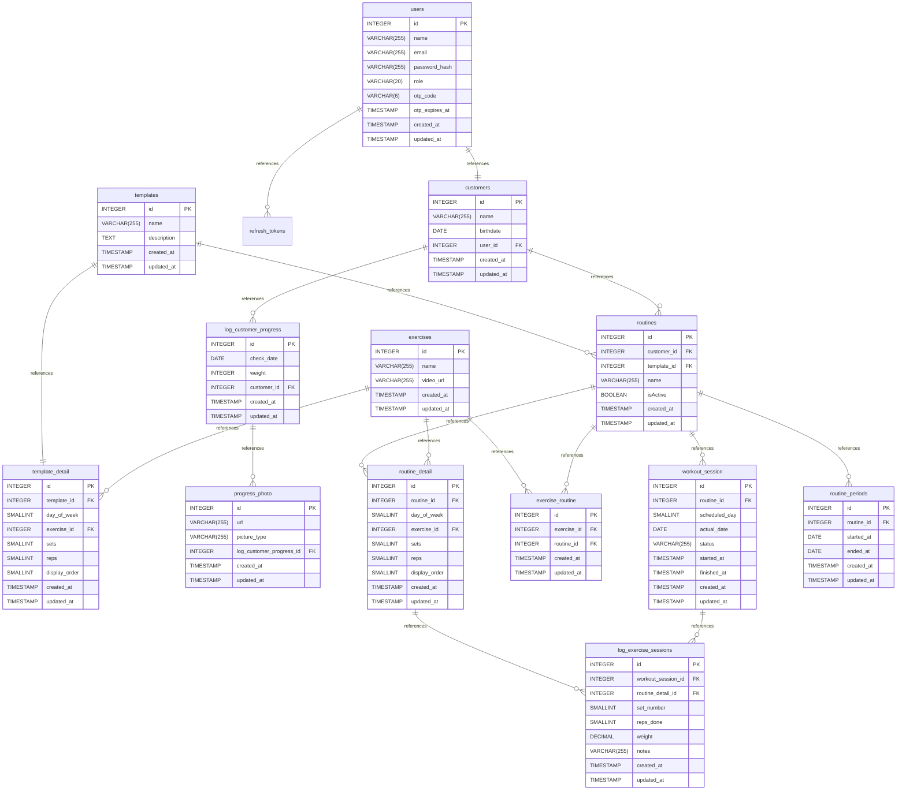

# Database Schema

## Overview

This document describes the complete database schema for the Kochappi API. The system is designed to manage personal training operations: coaches assign workout routines to customers, track their progress over time, and log individual workout sessions.

---

## ER Diagram

---

## Table Reference

### Authentication & Users

#### `users`
Stores authentication credentials. Each user has a role that determines their access level (e.g., `coach`, `admin`, `customer`). A user account is the entry point for accessing the system.

| Column | Type | Description |
|---|---|---|
| `id` | INTEGER | Primary key |
| `name` | VARCHAR(255) | Full name |
| `email` | VARCHAR(255) | Unique login identifier |
| `password_hash` | VARCHAR(255) | Bcrypt-hashed password |
| `role` | VARCHAR(20) | Access level (e.g., `coach`, `admin`, `customer`) |
| `otp_code` | VARCHAR(6) | One-time password for 2FA verification |
| `otp_expires_at` | TIMESTAMP | Expiration time for the OTP code |
| `created_at` | TIMESTAMP | Record creation time |
| `updated_at` | TIMESTAMP | Last update time |

#### `customers`
Represents the end clients (athletes) being coached. Each customer is linked to a `users` record so they can optionally log in. Holds personal data relevant to fitness tracking.

| Column | Type | Description |
|---|---|---|
| `id` | INTEGER | Primary key |
| `name` | VARCHAR(255) | Full name |
| `birthdate` | DATE | Used for age calculations |
| `user_id` | INTEGER FK | Links to `users` |
| `created_at` | TIMESTAMP | Record creation time |
| `updated_at` | TIMESTAMP | Last update time |

#### `refresh_tokens`
Stores refresh tokens used for session management and authentication. Each token is associated with a user and has an expiration time. Used to issue new access tokens without requiring re-authentication.

| Column | Type | Description |
|---|---|---|
| `id` | VARCHAR(36) | Primary key (UUID string) |
| `user_id` | INTEGER FK | Links to `users` |
| `expires_at` | TIMESTAMP | Token expiration timestamp |
| `created_at` | TIMESTAMP | Record creation time |

---

### Exercise Library

#### `exercises`
A catalog of all available exercises. Acts as the single source of truth for exercise definitions, referenced by both templates and routines.

| Column | Type | Description |
|---|---|---|
| `id` | INTEGER | Primary key |
| `name` | VARCHAR(255) | Exercise name (e.g., "Bench Press") |
| `video_url` | VARCHAR(255) | Link to a demonstration video |
| `created_at` | TIMESTAMP | Record creation time |
| `updated_at` | TIMESTAMP | Last update time |

---

### Templates

#### `templates`
Reusable workout program blueprints. A coach can create a template once and then assign it to multiple customers as a starting point for their routine.

| Column | Type | Description |
|---|---|---|
| `id` | INTEGER | Primary key |
| `name` | VARCHAR(255) | Template name (e.g., "Push/Pull/Legs 3-Day") |
| `description` | TEXT | Overview of the program |
| `created_at` | TIMESTAMP | Record creation time |
| `updated_at` | TIMESTAMP | Last update time |

#### `template_detail`
Defines the individual exercises within a template, organized by day of the week with prescribed sets, reps, and display order.

| Column | Type | Description |
|---|---|---|
| `id` | INTEGER | Primary key |
| `template_id` | INTEGER FK | Parent template |
| `day_of_week` | SMALLINT | Day number (e.g., 1=Monday) |
| `exercise_id` | INTEGER FK | The exercise to perform |
| `sets` | SMALLINT | Prescribed number of sets |
| `reps` | SMALLINT | Prescribed number of reps |
| `display_order` | SMALLINT | Sort order within the day |
| `created_at` | TIMESTAMP | Record creation time |
| `updated_at` | TIMESTAMP | Last update time |

---

### Routines

#### `routines`
A routine is a personalized workout program assigned to a specific customer. It can be created from scratch or derived from a template. Only one routine should be active per customer at a time (`isActive`).

| Column | Type | Description |
|---|---|---|
| `id` | INTEGER | Primary key |
| `customer_id` | INTEGER FK | The customer this routine belongs to |
| `template_id` | INTEGER FK | Source template, if any |
| `name` | VARCHAR(255) | Routine name |
| `isActive` | BOOLEAN | Whether this is the customer's current routine |
| `created_at` | TIMESTAMP | Record creation time |
| `updated_at` | TIMESTAMP | Last update time |

#### `routine_detail`
The concrete exercises within a routine for a specific customer. Similar structure to `template_detail` but customer-specific — allows modifications from the base template.

| Column | Type | Description |
|---|---|---|
| `id` | INTEGER | Primary key |
| `routine_id` | INTEGER FK | Parent routine |
| `day_of_week` | SMALLINT | Day number |
| `exercise_id` | INTEGER FK | The exercise to perform |
| `sets` | SMALLINT | Prescribed sets |
| `reps` | SMALLINT | Prescribed reps |
| `display_order` | SMALLINT | Sort order within the day |
| `created_at` | TIMESTAMP | Record creation time |
| `updated_at` | TIMESTAMP | Last update time |

#### `routine_periods`
Tracks the date range during which a routine was (or is being) followed. Useful for historical reporting — e.g., "this customer followed Routine X from January to March."

| Column | Type | Description |
|---|---|---|
| `id` | INTEGER | Primary key |
| `routine_id` | INTEGER FK | The routine being tracked |
| `started_at` | DATE | Date the routine began |
| `ended_at` | DATE | Date the routine ended (null if ongoing) |
| `created_at` | TIMESTAMP | Record creation time |
| `updated_at` | TIMESTAMP | Last update time |

---

### Workout Sessions

#### `workout_session`
Represents a single workout day executed by a customer. It links a routine to a specific date, tracking the session's status and duration.

| Column | Type | Description |
|---|---|---|
| `id` | INTEGER | Primary key |
| `routine_id` | INTEGER FK | The routine this session belongs to |
| `scheduled_day` | SMALLINT | The day of the week this session was planned for |
| `actual_date` | DATE | The real calendar date it was performed |
| `status` | VARCHAR(255) | e.g., `pending`, `in_progress`, `completed`, `skipped` |
| `started_at` | TIMESTAMP | When the session started |
| `finished_at` | TIMESTAMP | When the session ended |
| `created_at` | TIMESTAMP | Record creation time |
| `updated_at` | TIMESTAMP | Last update time |

#### `log_exercise_sessions`
The most granular log — records the actual performance for each set of each exercise within a session. This is the raw data used for progress analytics.

| Column | Type | Description |
|---|---|---|
| `id` | INTEGER | Primary key |
| `workout_session_id` | INTEGER FK | The parent session |
| `routine_detail_id` | INTEGER FK | The prescribed exercise being logged |
| `set_number` | SMALLINT | Which set this entry represents |
| `reps_done` | SMALLINT | Actual reps performed |
| `weight` | DECIMAL | Load used (kg or lbs) |
| `notes` | VARCHAR(255) | Optional coach/athlete notes |
| `created_at` | TIMESTAMP | Record creation time |
| `updated_at` | TIMESTAMP | Last update time |

---

### Progress Tracking

#### `log_customer_progress`
Periodic body measurements for a customer. Currently tracks body weight on a given date, serving as the top-level record for a progress check-in.

| Column | Type | Description |
|---|---|---|
| `id` | INTEGER | Primary key |
| `check_date` | DATE | Date of the measurement |
| `weight` | INTEGER | Body weight at check-in |
| `customer_id` | INTEGER FK | The customer being measured |
| `created_at` | TIMESTAMP | Record creation time |
| `updated_at` | TIMESTAMP | Last update time |

#### `progress_photo`
Photos attached to a progress check-in. The `picture_type` field categorizes the photo (e.g., `front`, `side`, `back`) for structured before/after comparisons.

| Column | Type | Description |
|---|---|---|
| `id` | INTEGER | Primary key |
| `url` | VARCHAR(255) | URL to the stored image |
| `picture_type` | VARCHAR(255) | Angle/category (e.g., `front`, `side`, `back`) |
| `log_customer_progress_id` | INTEGER FK | Parent progress log entry |
| `created_at` | TIMESTAMP | Record creation time |
| `updated_at` | TIMESTAMP | Last update time |
